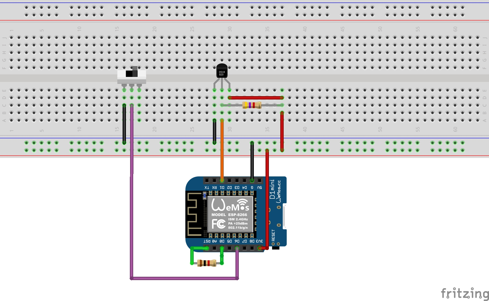

# MQTTerm
wemosD1 MQTT thermometer based on DS18B20 sensor

This project implements a simple thermometer which read temperature using a DS18B20 sensor and publish it on a MQTT topic.

The MQTT thermometer works in two modes:

1. SINGLE read: performs a single read and then goes to deep sleep for a configurable period of time
2. CONTINUOS read: performs continuous delayed read with no deep sleep. This is for "real-time" measurements

The MQTT thermometer mode is selected through the switch present in the project.

